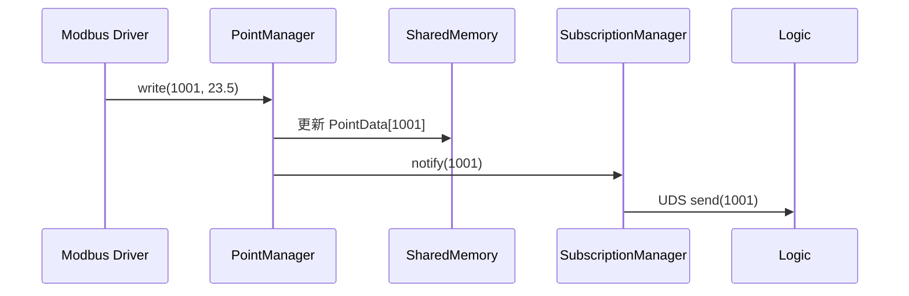
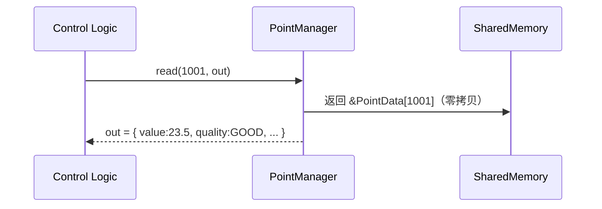

当然可以。以下是 **InduRTDB（Industrial Real-Time Database）** 的整体概要设计文档，聚焦于**架构分层、核心组件、数据流与关键技术选型**，为后续详细设计和开发提供清晰蓝图。

---

# **InduRTDB 概要设计文档（High-Level Design, HLD）**  
**版本：1.0**  
**日期：2026年3月26日**

---

## 1. 设计目标

构建一个面向工业边缘控制场景的**超低延迟、多进程共享、语义完备**的实时数据库，满足以下核心诉求：

- ✅ **确定性性能**：P99 读写延迟 ≤ 10 μs  
- ✅ **工业语义**：每个点位携带质量、单位、权限、时间戳  
- ✅ **多进程安全**：支持驱动、逻辑引擎、HMI 并发访问  
- ✅ **轻量可靠**：静态库 ≤ 50 KB，7×24 运行无故障  
- ✅ **易集成**：提供 C++/C API，可作为 OPC UA Server 后端  

---

## 2. 整体架构

InduRTDB 采用 **三层分层架构**，严格隔离平台相关与平台无关逻辑：

```plaintext
+───────────────────────────────────────────────────────+
│                Application Layer                       │
│  • BAS 驱动 (Modbus, BACnet)                          │
│  • 控制逻辑引擎 (PID, Sequencer)                      │
│  • HMI / Web UI                                       │
│  • OPC UA Server (Bridge)                             │
│                                                       │
│  ← 使用 InduRTDB C++/C API 进行读写/订阅              │
+───────────────────────────┬───────────────────────────+
                            │
+───────────────────────────▼───────────────────────────+
│               InduRTDB Core Layer (Platform Agnostic) │
│  ┌─────────────────┐    ┌─────────────────────────┐   │
│  │ PointManager    │    │ SubscriptionManager     │   │
│  │ • write(id,val) │    │ • subscribe(id, cb)     │   │
│  │ • read(id)      │    │ • Heartbeat cleanup     │   │
│  └─────────┬───────┘    └───────────────┬─────────┘   │
│            │                            │             │
│  ┌─────────▼────────────────────────────▼─────────┐   │
│  │           SharedMemorySegment                 │   │
│  │  • Header (magic, seq, stats)                 │   │
│  │  • PointData[MAX_POINTS] (aligned array)      │   │
│  │  • SubscriberTable[MAX_SUBS]                  │   │
│  └───────────────────────────────────────────────┘   │
+───────────────────────────┬───────────────────────────+
                            │
+───────────────────────────▼───────────────────────────+
│          OS Abstraction Layer (OSAL)                  │
│  ┌─────────────┐  ┌──────────────┐  ┌─────────────┐  │
│  │ SharedMem   │  │ Threading    │  │ Time        │  │
│  │ • shm_open  │  │ • Seqlock    │  │ • clock_gettime││
│  │ • mmap      │  │ • CPU Affinity│ │ • monotonic │  │
│  └─────────────┘  └──────────────┘  └─────────────┘  │
│  ┌─────────────┐                                     │
│  │ Notification│ ← Unix Domain Socket (UDS)          │
│  └─────────────┘                                     │
+───────────────────────────────────────────────────────+
```

> **关键原则**：  
> - **Core 层 100% 平台无关**，仅依赖 OSAL 接口；  
> - **OSAL 层每平台 ≤ 300 行代码**，实现“一次编写，多平台部署”。

---

## 3. 核心组件设计

### 3.1 `SharedMemorySegment`（共享内存段）

#### 内存布局（定长、对齐、无指针）
```cpp
// 共享内存起始地址 = mmap() 返回值
struct InduRTDBHeader {
    uint32_t magic;         // 0x1DBA
    uint32_t version;
    uint32_t max_points;
    uint32_t max_subscribers;
    uint64_t write_seq;     // Seqlock 用（偶数=空闲，奇数=写中）
    struct {                // 统计信息
        uint64_t writes;
        uint64_t timeouts;
    } stats;
} __attribute__((aligned(64)));

struct PointData { /* 见 SRS 文档 */ } __attribute__((aligned(64)));

struct SubscriberEntry {
    pid_t pid;
    uint64_t last_heartbeat_ns;
} __attribute__((aligned(8)));
```

- **总大小** = `sizeof(Header) + MAX_POINTS * sizeof(PointData) + MAX_SUBS * sizeof(SubscriberEntry)`
- **默认配置**：`MAX_POINTS = 10,000`，`MAX_SUBS = 32`

#### 关键特性：
- **零拷贝读取**：`read(id)` 直接返回 `const PointData*`
- **Seqlock 保护写入**：避免锁竞争，读操作无阻塞
- **崩溃安全**：所有字段为 POD 类型，无跨进程指针

---

### 3.2 `PointManager`（点位管理器）

#### 职责：
- 管理 `PointData` 数组生命周期
- 提供 `write()` / `read()` 接口
- 自动更新时间戳、质量标记

#### 写入流程（Seqlock）：
```cpp
bool write(PointId id, double val) {
    auto* p = &points_[id];
    uint64_t seq0 = __atomic_load_n(&header_->write_seq, __ATOMIC_ACQUIRE);
    if (seq0 & 1) return false; // 写冲突（极罕见）

    // 更新数据
    p->value.d = val;
    p->timestamp_ns = osal_->time()->now_ns();
    p->quality = Quality::GOOD;

    // 提交：seq+1（奇）→ seq+2（偶）
    __atomic_store_n(&header_->write_seq, seq0 + 1, __ATOMIC_RELEASE);
    __atomic_store_n(&header_->write_seq, seq0 + 2, __ATOMIC_RELEASE);

    subscription_mgr_.notify(id); // 触发订阅
    return true;
}
```

---

### 3.3 `SubscriptionManager`（订阅管理器）

#### 职责：
- 注册/注销回调函数
- 通过 UDS 通知订阅者“点位变更”
- 定期清理僵尸进程（心跳超时 >1s）

#### 心跳机制：
- 每个 Reader 进程每 100ms 调用 `update_heartbeat(pid)`
- 后台线程每 500ms 扫描 `SubscriberTable`，`kill(pid, 0)` 验活

#### 通知协议：
- UDS 消息格式：`{ uint32_t point_id }`
- 避免传递完整数据，减少 IPC 开销

---

### 3.4 `OSAL`（操作系统抽象层）

| 模块 | Linux 实现 | SylixOS 实现 |
|------|-----------|-------------|
| **SharedMem** | `shm_open` + `mmap` | `shmCreate` + `mmap` |
| **Threading** | Seqlock（原子操作） | 同左 |
| **Time** | `clock_gettime(CLOCK_MONOTONIC_RAW)` | `clock_gettime(CLOCK_REALTIME)` |
| **Notification** | Unix Domain Socket | 同左 |

> **编译时选择**：通过 `#ifdef SYLIXOS` 切换实现

---

## 4. 关键数据流

### 4.1 写入流程（驱动 → RTDB）


### 4.2 读取流程（逻辑引擎 → RTDB）


---

## 5. 技术选型与约束

| 领域 | 选型 | 理由 |
|------|------|------|
| **并发控制** | Seqlock | 读无锁、写低开销，适合“多读少写” |
| **共享内存** | POSIX shm_open | 标准、robust、SylixOS 兼容 |
| **通知机制** | Unix Domain Socket | 本地高效、支持 fd 传递 |
| **配置格式** | YAML | 人类可读，支持注释 |
| **构建系统** | CMake | 跨平台、嵌入式友好 |
| **测试框架** | Google Test | 主流、支持 Mock |

### 约束：
- **禁止动态内存分配**（`new`/`malloc`）；
- **禁止 STL 容器**（`vector`, `map`）；
- **禁止异常**（`-fno-exceptions`）；
- **C++17 only**，无第三方依赖（YAML 解析可选）。

---

## 6. 部署模型

- **嵌入式库模式**：静态链接到 `bas_point_svc`、`logic_engine` 等服务；
- **多实例隔离**：通过段名 `/indurtdb_hvac`、`/indurtdb_lighting` 区分；
- **无独立进程**：RTDB 本身不运行 daemon，由首个使用者创建段。

---

## 7. 与外部系统集成

| 外部系统 | 集成方式 |
|----------|--------|
| **OPC UA Server** | 开发 `InduRTDB-OPC-UA Bridge`，将 PointData 映射到 Address Space |
| **SCADA (InPlant)** | 通过 OPC UA 或 MQTT 桥接 |
| **云平台 (IoT)** | 通过边缘代理上传关键点位 |

> **InduRTDB 专注“内部高速总线”，不直接暴露网络接口**。

---

## 8. 风险与缓解

| 风险 | 缓解措施 |
|------|--------|
| **Seqlock 在高写冲突下性能下降** | 工业场景“多读少写”，冲突概率 <0.1% |
| **SylixOS mmap 行为差异** | OSAL 层封装，单元测试覆盖 |
| **Cache 伪共享（False Sharing）** | `PointData` 按 64B 对齐 |
| **FD 泄漏（UDS）** | RAII 封装 `unique_fd` |

---

## 9. 下一步计划

1. **Week 1**：实现 `SharedMemorySegment` + `PointManager`（Linux）
2. **Week 2**：添加 `SubscriptionManager` + 心跳机制
3. **Week 3**：移植到 SylixOS，验证多进程场景
4. **Week 4**：集成 YAML 配置 + gtest 覆盖率 ≥80%

---

> **InduRTDB 的成功，不在于它有多复杂，而在于它让复杂的工业控制变得简单、确定、可靠**。

此概要设计已覆盖系统核心，可作为详细设计（LLD）和编码的依据。  
如需 **类图（UML）**、**共享内存布局计算表** 或 **CMakeLists.txt 模板**，请随时告知。