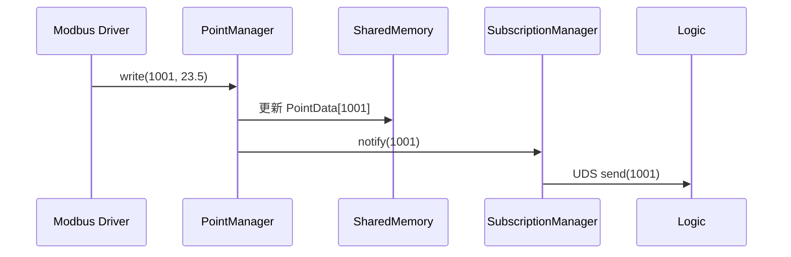
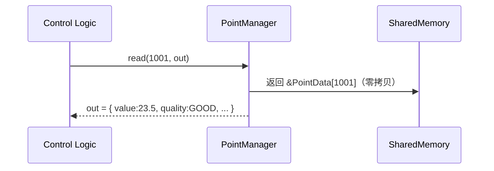

当然可以。以下是 **InduRTDB（Industrial Real-Time Database）** 的整体概要设计文档，聚焦于**架构分层、核心组件、数据流与关键技术选型**，为后续详细设计和开发提供清晰蓝图。

---

# **InduRTDB 概要设计文档（High-Level Design, HLD）**  
**版本：3.0.0**
**日期：2026年7月21日**
**修订说明**：纯 C11 重写，移除 C++ 类层次，所有模块改为 C 结构体 + 自由函数；API 层从 C++/C ABI 双轨改为纯 C 单头文件

---

## 1. 设计目标

构建一个面向工业边缘控制场景的**超低延迟、多进程共享、语义完备**的实时数据库，满足以下核心诉求：

- ✅ **确定性性能**：P99 读写延迟 ≤ 10 μs  
- ✅ **工业语义**：每个点位携带质量、单位、权限、时间戳  
- ✅ **多进程安全**：支持驱动、逻辑引擎、HMI 并发访问  
- ✅ **轻量可靠**：零第三方依赖，7×24 运行无故障  
- ✅ **易集成**：提供 C++/C API，可作为 OPC UA Server 后端  

---

## 2. 整体架构

InduRTDB 采用 **四层分层架构**，严格隔离平台相关与平台无关逻辑：

```plaintext
+───────────────────────────────────────────────────────+
│                Application Layer                       │
│  • BAS 驱动 (Modbus, BACnet)                          │
│  • 控制逻辑引擎 (PID, Sequencer)                      │
│  • HMI / Web UI                                       │
│  • OPC UA Server (Bridge)                             │
│                                                       │
│  ← 使用 indurtdb.h C API 进行读写/订阅                │
+───────────────────────────┬───────────────────────────+
                            │
+───────────────────────────▼───────────────────────────+
│                   API Layer (纯 C11)                   │
│  ┌─────────────────────────────────────────────────┐  │
│  │      indurtdb.h — 单头文件，24 个 C 函数        │  │
│  │      indurtdb.c — 单例实现，串联所有模块        │  │
│  │      extern "C" 包裹，兼容 C/Python/Rust        │  │
│  └─────────────────────────────────────────────────┘  │
+───────────────────────────┬───────────────────────────+
                            │
+───────────────────────────▼───────────────────────────+
│               InduRTDB Core Layer (纯 C11)             │
│  ┌───────────────┐  ┌──────────────┐  ┌───────────┐  │
│  │ irt_point_    │  │ irt_subscrip-│  │ irt_config │  │
│  │ manager.c/h   │  │ tion.c/h     │  │ .c/h       │  │
│  │ • irt_pm_write│  │ • irt_sub_reg│  │ • irt_     │  │
│  │ • irt_pm_read │  │ • irt_sub_not│  │   config_  │  │
│  │ • irt_pm_peek │  │ • heartbeat  │  │   parse    │  │
│  └───────┬───────┘  └──────┬───────┘  └──────┬────┘  │
│          │                 │                  │       │
│  ┌───────▼─────────────────▼──────────────────▼─────┐ │
│  │           irt_shm.c/h — 共享内存段              │ │
│  │  • Header (magic/version/write_seq/stats)       │ │
│  │  • PointData[MAX_POINTS] (128B aligned)         │ │
│  │  • SubscriberEntry[MAX_SUBS] (16B aligned)      │ │
│  └─────────────────────────────────────────────────┘ │
│                                                       │
│  irt_seqlock.h: 轻量 inline 自由函数（__atomic 操作） │
+───────────────────────────┬───────────────────────────+
                            │
+───────────────────────────▼───────────────────────────+
│          OS Abstraction Layer (OSAL, 纯 C11)           │
│  irt_osal.h: 两个导出函数                              │
│  ┌───────────────────────┐  ┌──────────────────────┐   │
│  │ irt_shm_os_map/       │  │ irt_time_now_ns()    │   │
│  │ unmap/is_owner        │  │ clock_gettime(MONO)  │   │
│  └───────────────────────┘  └──────────────────────┘   │
│  posix/irt_osal_posix.c | sylixos/irt_osal_sylixos.c   │
+───────────────────────────────────────────────────────+
```

> **关键原则**：  
> - **Core 层 100% 平台无关**，仅依赖 OSAL 接口；  
> - **OSAL 层每平台 ≤ 300 行代码**，实现“一次编写，多平台部署”。

---

## 3. 核心组件设计

### 3.1 `SharedMemorySegment`（共享内存段）

#### 内存布局（定长、对齐、无指针）
```cpp
// 共享内存起始地址 = mmap() 返回值
struct InduRTDBHeader {
    uint32_t magic;         // 0x1DBA1DBA
    uint32_t version;
    uint32_t max_points;
    uint32_t max_subscribers;
    uint64_t write_seq;     // Seqlock 用（偶数=空闲，奇数=写中）
    struct {                // 统计信息
        uint64_t writes;
        uint64_t timeouts;
    } stats;
} __attribute__((aligned(64)));

struct PointData { /* 见 SRS 文档 */ } __attribute__((packed, aligned(128)));

struct SubscriberEntry {
    Pid pid;
    TimestampNs last_heartbeat_ns;
} __attribute__((packed, aligned(16)));
```

- **总大小** = `sizeof(Header) + MAX_POINTS * sizeof(PointData) + MAX_SUBS * sizeof(SubscriberEntry)`
- **默认配置**：`MAX_POINTS = 10,000`，`MAX_SUBS = 32`

#### 关键特性：
- **零拷贝读取**：`read(id)` 直接返回 `const PointData*`
- **Seqlock 保护写入**：避免锁竞争，读操作无阻塞
- **崩溃安全**：所有字段为 POD 类型，无跨进程指针

---

### 3.2 `PointManager`（点位管理器）

#### 职责：
- 管理 `PointData` 数组生命周期（直接操作共享内存）
- 提供模板 `write<T>()` / `read()` 接口
- 全局 Seqlock（header_->write_seq）保护写入
- 自动更新时间戳、质量标记

#### 写入流程（模板 + 全局 Seqlock）：
```cpp
template<typename T>
bool write(PointId id, const T& value) {
    auto* p = &points_[id];

    // Seqlock write begin
    uint64_t seq0 = __atomic_load_n(&header_->write_seq, __ATOMIC_ACQUIRE);
    if (seq0 & 1) return false; // 写冲突

    __atomic_store_n(&header_->write_seq, seq0 + 1, __ATOMIC_RELEASE);

    // if constexpr 编译期类型分发
    if constexpr (std::is_same_v<T, double>) {
        p->value.d = value; p->type = PointType::DOUBLE;
    } else if constexpr (std::is_same_v<T, int32_t>) {
        p->value.i = value; p->type = PointType::INT32;
    } else if constexpr (std::is_same_v<T, bool>) {
        p->value.b = value; p->type = PointType::BOOL;
    }

    p->timestamp_ns = time_->now_ns();
    p->quality = Quality::GOOD;

    // Seqlock write end
    __atomic_store_n(&header_->write_seq, seq0 + 2, __ATOMIC_RELEASE);
    header_->stats.writes++;
    return true;
}
```

---

### 3.3 `SubscriptionManager`（订阅管理器）

#### 职责：
- 注册/注销回调函数
- 通过 UDS 通知订阅者“点位变更”
- 定期清理僵尸进程（心跳超时 >1s）

#### 心跳机制：
- 每个订阅者进程定期调用 `update_heartbeat(pid)` 更新时间戳
- `cleanup_zombies()` 扫描心跳表，清理超时（>1s）的僵尸进程条目

#### 通知协议：
- UDS 消息格式：`{ uint32_t point_id }`
- 避免传递完整数据，减少 IPC 开销

---

### 3.4 `OSAL`（操作系统抽象层）

| 模块 | Linux 实现 | SylixOS 实现 |
|------|-----------|-------------|
| **SharedMem** | `shm_open` + `mmap` | `shmCreate` + `mmap` |
| **Threading** | Seqlock（原子操作） | 同左 |
| **Time** | `clock_gettime(CLOCK_MONOTONIC_RAW)` | `clock_gettime(CLOCK_REALTIME)` |
| **Notification** | Unix Domain Socket | 同左 |

> **编译时选择**：通过 `#ifdef SYLIXOS` 切换实现

---

### 3.5 模块关系设计（C 模块依赖图）

```
┌────────────────────────────────────────────────────────────┐
│               indurtdb.c (公共 API 单例)                    │
│  持有全局状态: g_shm, g_pm, g_sub, g_config                │
│  导出 24 个 indurtdb_* 函数                                 │
│  串联: init → irt_shm_init → irt_pm_init → irt_sub_init   │
└───────────┬──────────────┬──────────────┬──────────────────┘
            │              │              │
┌───────────▼──┐  ┌────────▼───────┐  ┌──▼──────────────────┐
│ irt_point_   │  │ irt_subscrip-  │  │ irt_config.c        │
│ manager.c    │  │ tion.c         │  │ • irt_config_parse()│
│ • irt_pm_    │  │ • irt_sub_reg  │  │ • irt_config_get_*()│
│   write_bool │  │ • irt_sub_unreg│  │ key=value 解析器     │
│   /int32     │  │ • irt_sub_not  │  └─────────────────────┘
│   /double    │  │ • irt_sub_hb   │
│   /string    │  │ • irt_sub_zomb │
│ • irt_pm_    │  │ 定长 Slot[256] │
│   read_*     │  └───────┬────────┘
│ • irt_pm_    │          │
│   peek       │          │
│ • irt_pm_    │          │
│   read_range │          │
│ • irt_pm_    │          │
│   write_     │          │
│   range_*    │          │
└──────┬───────┘          │
       │                  │
┌──────▼──────────────────▼──────────────┐
│         irt_shm.c — 共享内存段          │
│  • irt_shm_init(name, max_pts, max_sub)│
│  • irt_shm_shutdown()                  │
│  • irt_shm_header/points/subscribers   │
│  → 调用 OSAL: irt_shm_os_map/unmap     │
└──────────────┬─────────────────────────┘
               │
┌──────────────▼─────────────────────────┐
│       irt_osal.h (OSAL 接口, 纯 C)      │
│  irt_shm_os_map(name, sz, &owner)      │
│  irt_shm_os_unmap(addr, sz, owner)     │
│  irt_shm_os_is_owner()                 │
│  irt_time_now_ns()                     │
│                                        │
│  posix/irt_osal_posix.c                │
│  sylixos/irt_osal_sylixos.c            │
└────────────────────────────────────────┘
```

> **Core 层设计原则**：
> - **零虚函数**：所有 C 结构体 + 自由函数，编译期绑定
> - **零 STL**：定长数组替代所有动态容器
> - **零异常**：全部 `int` 返回码 (0=成功, <0=错误)
> - **Seqlock 为 `irt_seqlock.h` 头文件中的 inline 函数**：操作 `header->write_seq`

#### 接口设计（C 风格）

**OSAL 接口（纯 C，无虚函数）：**
```c
// irt_osal.h — 4 个导出函数
void* irt_shm_os_map(const char* name, size_t size, bool* is_owner);
void  irt_shm_os_unmap(void* addr, size_t size, bool is_owner);
bool  irt_shm_os_is_owner(void);
uint64_t irt_time_now_ns(void);
```

**Core 层接口（C 模块 + 结构体）：**
```c
// irt_point_manager.h
typedef struct {
    irt_header_t*  header;
    irt_point_t*   points;
    uint32_t       max_points;
} irt_pm_t;

int  irt_pm_init(irt_pm_t* pm, void* shm_base, uint32_t max_points);
int  irt_pm_write_bool(irt_pm_t* pm, uint32_t id, bool value);
int  irt_pm_write_int32(irt_pm_t* pm, uint32_t id, int32_t value);
int  irt_pm_write_double(irt_pm_t* pm, uint32_t id, double value);
int  irt_pm_write_string(irt_pm_t* pm, uint32_t id, const char* value);
int  irt_pm_read_bool(const irt_pm_t* pm, uint32_t id, bool* out);
int  irt_pm_read_int32(const irt_pm_t* pm, uint32_t id, int32_t* out);
int  irt_pm_read_double(const irt_pm_t* pm, uint32_t id, double* out);
int  irt_pm_read_string(const irt_pm_t* pm, uint32_t id, char* buf, size_t sz);
const irt_point_t* irt_pm_peek(const irt_pm_t* pm, uint32_t id);
int  irt_pm_read_range(const irt_pm_t* pm, uint32_t start, uint16_t cnt,
                       irt_point_t* out, uint16_t out_cap);
int  irt_pm_write_range_bool(irt_pm_t* pm, uint32_t start,
                             const bool* vals, uint16_t cnt);
int  irt_pm_write_range_int32(irt_pm_t* pm, uint32_t start,
                              const int32_t* vals, uint16_t cnt);
int  irt_pm_write_range_double(irt_pm_t* pm, uint32_t start,
                               const double* vals, uint16_t cnt);

// irt_seqlock.h — inline 自由函数
static inline uint64_t irt_seqlock_write_begin(uint64_t* seq);
static inline void     irt_seqlock_write_end(uint64_t* seq, uint64_t s0);
static inline bool     irt_seqlock_read_begin(const uint64_t* seq, uint64_t* out);
```

---

## 4. 关键数据流

### 4.1 写入流程（驱动 → RTDB）


### 4.2 读取流程（逻辑引擎 → RTDB）


---

## 5. 技术选型与约束

| 领域 | 选型 | 理由 |
|------|------|------|
| **并发控制** | Seqlock | 读无锁、写低开销，适合“多读少写” |
| **共享内存** | POSIX shm_open | 标准、robust、SylixOS 兼容 |
| **通知机制** | Unix Domain Socket | 本地高效、支持 fd 传递 |
| **配置格式** | YAML | 人类可读，支持注释 |
| **构建系统** | CMake | 跨平台、嵌入式友好 |
| **测试框架** | Google Test | 主流、支持 Mock |

### 约束：
- **禁止动态内存分配**（`new`/`malloc`）—— Core 层零堆分配；
- **禁止 STL 容器**（`vector`, `map`）—— 定长数组替代；
- **禁止异常**（`-fno-exceptions`）—— 全部 bool 返回值；
- **Core 层禁止虚函数** —— 编译期绑定；
- **C++17 only**，无第三方依赖（YAML 解析可选）。

---

## 6. 部署模型

- **嵌入式库模式**：静态链接到 `bas_point_svc`、`logic_engine` 等服务；
- **多实例隔离**：通过段名 `/indurtdb_hvac`、`/indurtdb_lighting` 区分；
- **无独立进程**：RTDB 本身不运行 daemon，由首个使用者创建段。

---

## 7. 扩展性设计

### 7.1 可扩展点
1. **新数据类型**：在 `PointType` 枚举中添加新类型
2. **新质量标记**：在 `Quality` 枚举中添加新标记
3. **新单位**：在 `Unit` 枚举中添加新单位
4. **新平台支持**：实现新的 OSAL 平台适配（仅需 ≤300 行/平台）
5. **新通知机制**：实现新的 `INotification` 接口

### 7.2 插件架构
- **配置插件**：ConfigLoader 可扩展支持 JSON/XML 格式
- **监控插件**：预留 Prometheus 指标导出接口（基于 Header.stats）
- **桥接插件**：OPC UA/MQTT/Modbus 桥接（独立进程，通过 API 交互）

---

## 8. 与外部系统集成

| 外部系统 | 集成方式 |
|----------|--------|
| **OPC UA Server** | 开发 `InduRTDB-OPC-UA Bridge`，将 PointData 映射到 Address Space |
| **SCADA (InPlant)** | 通过 OPC UA 或 MQTT 桥接 |
| **云平台 (IoT)** | 通过边缘代理上传关键点位 |

> **InduRTDB 专注“内部高速总线”，不直接暴露网络接口**。

---

## 9. 风险与缓解

| 风险 | 缓解措施 |
|------|--------|
| **Seqlock 在高写冲突下性能下降** | 工业场景“多读少写”，冲突概率 <0.1% |
| **SylixOS mmap 行为差异** | OSAL 层封装，单元测试覆盖 |
| **Cache 伪共享（False Sharing）** | `PointData` 按 64B 对齐 |
| **FD 泄漏（UDS）** | RAII 封装 `unique_fd` |

---

## 10. 下一步计划

1. **Week 1**：实现 `SharedMemorySegment` + `PointManager`（Linux）
2. **Week 2**：添加 `SubscriptionManager` + 心跳机制
3. **Week 3**：移植到 SylixOS，验证多进程场景
4. **Week 4**：集成 YAML 配置 + gtest 覆盖率 ≥80%

---

> **InduRTDB 的成功，不在于它有多复杂，而在于它让复杂的工业控制变得简单、确定、可靠**。

---

**文档变更记录**

| 版本号 | 变更日期 | 变更内容 |
|--------|---------|---------|
| 1.0.0 | 2026-03-27 | 初始版本 |
| 1.1.0 | 2026-05-11 | 架构统一为 4 层，PointManager 对齐 SRS 模板接口 |
| 2.1.0 | 2026-05-16 | 合并工程框架架构设计文档内容，修正 magic 值/对齐，更新 API 签名 |
| 3.0.0 | 2026-07-21 | 纯 C11 重写：移除 C++ 类层次/虚函数/PIMPL，替换为 C 模块 (irt_shm/irt_pm/irt_sub/irt_config/irt_osal) + 自由函数；API 层从 C++/C ABI 双轨统一为纯 C 单头文件 indurtdb.h |